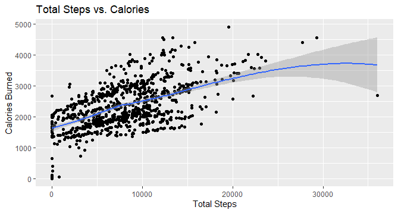
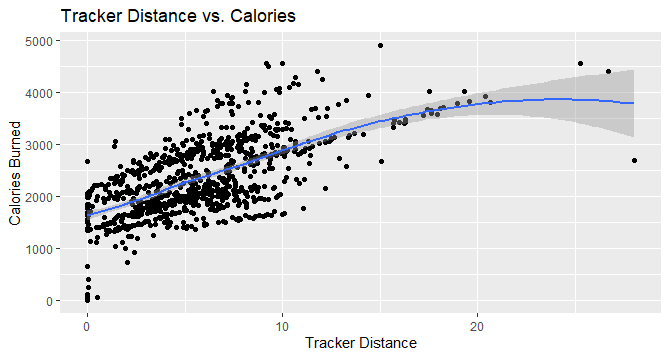
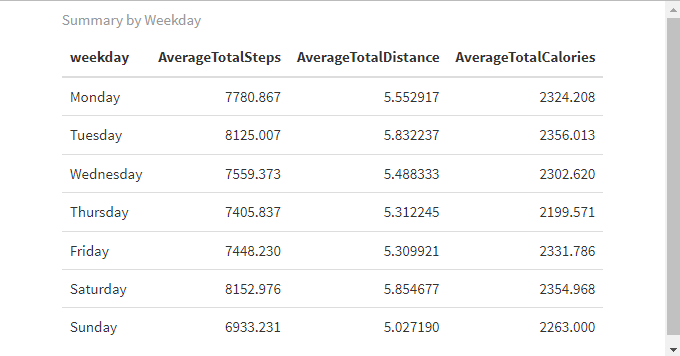
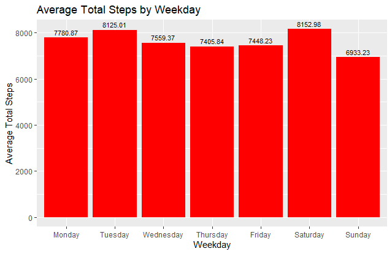
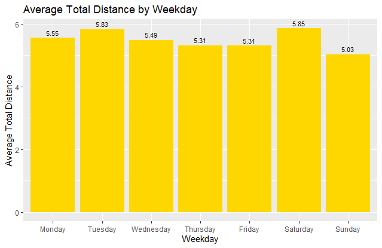
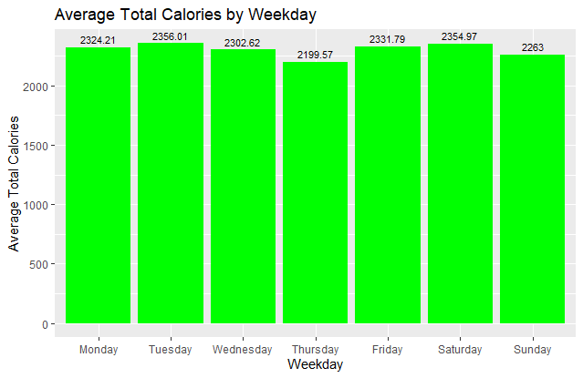

# Bellabeat - Exploratory Data Analysis

Author: Martín Lopera

date: August 31, 2023

## Table of contents

- [Scenario](#scenario)
- [Technologies](#technologies)
- [Methodologies](#methodologies)
- [Ask](#ask)
- [Prepare](#prepare)
- [Process](#process)
- [Analyze](#analyze)
- [Share](#share)
- [Act](#act)


## Scenario (#scenario)

Bellabeat is a high-tech manufacturer of health-focused products for
women and it is a successful small company with the potential to become
a larger player in the global smart device market. The project's focus
is to perform an exploratory data analysis on one of Bellabeat's
products to gain insight into how consumers are using their smart
devices by deep diving into smart device data in order to help guide the
marketing strategy for the company.

As this is a Capstone project for Google Data Analytics Certificate, it
would be organized in a series of questions recommended by the Case
Study Roadmap to help guide us students in the completion of an
understandable and legible project. These questions will be answered in
order and then I will document the whole process passing by each one of
the six steps of an exploratory data analysis.

## Technologies (#technologies)

-   **R :** Data retrieving, preparing, processing, analyzing and
    visualizing.
-   **Tableau Public:** Data sharing.

## Methodologies (#methodologies)

-   Retrieving, cleaning and processing data.

-   Uni-variate analysis.

-   Bi-variate analysis for correlations.

## Ask (#ask)

Business task is to analyze smart device usage data in order to gain
insight into how consumers use non-Bellabeat smart devices.

Primary stakeholders: Urška Sršen and Sando Mur, executive team members.

Secondary stakeholders: Bellabeat marketing analytics team.

**Questions to guide the analysis:**

1.  What are some trends in smart device usage?

2.  How could these trends apply to Bellabeat customers?

3.  How could these trends help influence Bellabeat marketing strategy?

## Prepare (#prepare)

Data: FitBit Fitness Tracker Data is a public data-set in Kaggle which
contains personal fitness tracker from around 30 FitBit users. Data
includes heart rate, physical activity, intensity of physical activity,
weight info and sleep monitoring.

**Where is your data stored?**

-   FitBit data is downloaded from
    <https://www.kaggle.com/datasets/arashnic/fitbit/codea> and stored
    in my local computer inside a folder destined to the entire project.

**How is the data organized? Is it long or wide format?**

-   Data is organized in 18 data sets in .csv format. It is long format.

**Are there issues with bias or credibility in this data? Does your data
ROCCC?**

-   *Reliability:* The data comes from 30 FitBit users who consented the
    recollection of their smart devices data.

-   *Original:* The data comes from the usage of a smart device.

-   *Comprehensive:* Yes, it contains several data-sets, each one with a
    functionality or a purpose like sleep tracking, steps taken, weight
    data, physical activity and more.

-   *Current:* Data is from 2016. It's not current but for academic
    purposes it works well.

-   *Cited:* Unknown.

**How are you addressing licensing, privacy, security and
accessibility?**

-   FitBit data is a public source data-set.

**How did you verify the data's integrity?**

-   First we install the necessary libraries and proceed to read the
    .csv files with `read.csv()`:

```{r, tidy=FALSE}
install.packages("tidyverse")  
install.packages("lubridate")  
install.packages("tidyr")  
install.packages("dplyr")  
install.packages("ggplot2")  
install.packages("knitr")  
install.packages("kableExtra")  
```

```{r}
library("tidyverse")
library("lubridate")
library("tidyr")
library("dplyr")
library("ggplot2")
library("knitr")
library("kableExtra")
```

```{r, echo=FALSE}
activities <- read.csv("...\\dailyActivity_merged.csv")
intensities <- read.csv("...\\hourlyIntensities_merged.csv")
calories <- read.csv("...\\hourlyCalories_merged.csv")
sleep <- read.csv("...\\sleepDay_merged.csv")
weight <- read.csv("...\\weightLogInfo_merged.csv")
heartrate <- read.csv("...\\heartrate_seconds_merged.csv")
```

There's some problems with the timestamp data. So before analysis I will
split the column where date and time it's stored into two columns and
fix it's formatting. Also I will eliminate columns that are not
necessary for this type of analysis:

```{r, echo=FALSE}

activities$ActivityDate = as.POSIXct(activities$ActivityDate, format="%m/%d/%Y", tz=Sys.timezone())

intensities$ActivityHour = as.POSIXct(intensities$ActivityHour, format="%m/%d/%Y %I:%M:%S %p", tz=Sys.timezone())

calories$ActivityHour = as.POSIXct(calories$ActivityHour, format="%m/%d/%Y %I:%M:%S %p", tz=Sys.timezone())

sleep$SleepDay = as.POSIXct(sleep$SleepDay, format="%m/%d/%Y %I:%M:%S %p", tz=Sys.timezone())

weight$Date = as.POSIXct(weight$Date, format="%m/%d/%Y %I:%M:%S %p", tz=Sys.timezone())

heartrate$Time = as.POSIXct(heartrate$Time, format="%Y/%m/%d %I:%M:%S %p", tz=Sys.timezone())

intensities$time <- format(intensities$ActivityHour, format= "%H:%M:%S")

intensities$date <- format(intensities$ActivityHour, format = "%m/%d/%y")

intensities$ActivityHour <- NULL

calories$time <- format(calories$ActivityHour, format = "%H:%M:%S")

calories$date <- format(calories$ActivityHour, format = "%m/%d/%y")

calories$ActivityHour <- NULL
weight$date <- format(weight$Date, format = "%H:%M:%S")
weight$time <- format(weight$Date, format = "%m/%d/%y")
weight$Date <- NULL
heartrate$time <- format(heartrate$Time, format = "%H:%M:%S")
heartrate$date <- format(heartrate$Time, format = "%y/%m/%d")
heartrate$Time <- NULL
weight$Fat <- NULL
weight$IsManualReport <- as.logical(weight$IsManualReport)
```

**How does it help you answer your question?**

-   As the data is more clean and organized, it is easier to find
    trends, correlations and other insights that might lead Bellabeat's
    marketing team into making data-driven decisions.

**Are there any problems with the data?**

-   Data has limitations as it only has 33 users data from daily
    activity, 24 from sleep and only 8 for weight. This is a small
    sample and for academic purposes works well but it is highly
    recommended to expand the number of users data in order to have a
    bigger perspective of the situation.

```{r, echo=FALSE}
unique_activities <- length(unique(activities$Id))
print(unique_activities)
unique_intensities <- length(unique(intensities$Id))
print(unique_intensities)
unique_calories <- length(unique(calories$Id))
print(unique_calories)
unique_sleep <- length(unique(sleep$Id))
print(unique_sleep)
unique_weight <- length(unique(weight$Id))
print(unique_weight)
unique_heartrate <- length(unique(heartrate$Id))
print(unique_heartrate)
```

## Process (#process)

**What tools are you using and why?**

-   I'm using R for all the stages of the exploratory data analysis.
    From the initial inspection of the data, preparing and cleaning it,
    to the process of the data and the analysis of it. I'm also using R
    to visualize the results of my analysis and finally, I'm using
    Tableau for the presentation to the stakeholders. I've decided to
    use these tools because of their data manipulation capacity (R) and
    their elegant and efficient way of presenting results (Tableau). I
    didn't use Excel because this is long format data and Excel couldn't
    handle it. SQL would have been a great option for data manipulation
    in this project too.

**Have you ensured your data's integrity?**

-   I have. The previous steps in the preparing phase of the project are
    assuring me integrity in my data-sets.

**What steps have you taken yo ensure that your data is clean?**

-   After fixing the formatting of some columns in my data-sets, I want
    to have a notion of how many blank rows and blank cells I'm dealing
    with.

```{r, echo=FALSE}
activities_blank_rows <- sum(rowSums(is.na(activities)) == ncol(activities))

intensities_blank_rows <- sum(rowSums(is.na(intensities)) == ncol(intensities))

calories_blank_rows <- sum(rowSums(is.na(calories)) == ncol(calories))

sleep_blank_rows <- sum(rowSums(is.na(sleep)) == ncol(sleep))

weight_blank_rows <- sum(rowSums(is.na(weight)) == ncol(weight))

heartrate_blank_rows <- sum(rowSums(is.na(heartrate)) == ncol(heartrate))

cat("Number of blank or null rows in activites dataframe: ", activities_blank_rows)

cat("Number of blank or null rows in intensities dataframe: ", intensities_blank_rows)

cat("Number of blank or null rows in calories dataframe: ", calories_blank_rows)

cat("Number of blank or null rows in sleep dataframe: ", sleep_blank_rows)

cat("Number of blank or null rows in weight dataframe: ", weight_blank_rows)

cat("Number of blank or null rows in heartrate dataframe: ", heartrate_blank_rows)
```

-   After searching and printing the number of blank rows, I noticed
    that there's no blank rows in any of the data-sets. Now let's apply
    this same procedure to search for blank cells:

```{r, echo=FALSE}
activities_blank_cells <- sum(is.na(activities))
intensities_blank_cells <- sum(is.na(intensities))
calories_blank_cells <- sum(is.na(calories))
sleep_blank_cells <- sum(is.na(sleep))
weight_blank_cells <- sum(is.na(weight))
heartrate_blank_cells <- sum(is.na(heartrate))
cat("Number of blank cells in activities dataframe: ", activities_blank_cells)
cat("Number of blank cells in intensities dataframe: ", intensities_blank_cells)
cat("Number of blank cells in calories dataframe: ", calories_blank_cells)
cat("Number of blank cells in sleep dataframe: ", sleep_blank_cells)
cat("Number of blank cells in weight dataframe: ", weight_blank_cells)
cat("Number of blank cells in heartrate dataframe: ", heartrate_blank_cells)
```

-   We have 0 blank cells in FitBit's data.

**How can you verify that your data is clean and ready to analyze?**

-   After checking for blank rows and blank cells, I simply use the
    `glimpse()`, `head()` and `str()` functions to make sure everything
    is in it's place and with the right formatting to be manipulated.

**Have you documented your cleaning process so you can review and share
those results?**

-   Yes, I have. In this README.md document are all the steps I took in
    order to clean and prepare my data. Also in the R code attached to
    this repository I documented all the steps I took in all phases of
    the project.

## Analyze (#analyze)

**How should you organize your data to perform analysis on it?**

-   It should be merged by 'Id' and 'date' columns in order to guarantee
    data's integrity and to be able to answer the initial questions for
    the analysis. Right now I haven't merged the data but I will after a
    few summary statistics:

#### activities

```{r, echo=FALSE}
activities %>%
  select(TotalSteps,
         TotalDistance,
         SedentaryMinutes,
         VeryActiveDistance,
         ModeratelyActiveDistance,
         LightActiveDistance,
         VeryActiveMinutes,
         FairlyActiveMinutes,
         LightlyActiveMinutes,
         Calories) %>%
  summary()
```

-   Average SedentaryMinutes is 991 (16 hours).

-   Average for: VeryActiveDistance, ModeratelyActiveDistance and
    LightActiveDistance are 1.50, 0.56 and 3.34 respectively.There is a
    high tendency for light active users but also for very active users.
    There is a low tendency for moderately active users. Active minutes
    summary also indicates us a high tendency for light users, moderate
    tendency for very active users and a low tendency for moderately
    active users.

-   According to CDC, the recommended amount of steps per day is 10,000.
    We can see that the average TotalSteps in this dataset is 7638,
    which is considerably less than the recommended. The CDC also
    recommends to walk 150 minutes per day of moderate intensity.

#### intensities

```{r, echo=FALSE}
intensities %>%
  select(TotalIntensity,
         AverageIntensity) %>%
  summary()
```

#### calories

```{r, echo=FALSE}
calories %>%
  select(Calories) %>%
  summary()
```

-   On the average, participants burn 97 calories per day.

#### sleep

```{r, echo=FALSE}
sleep %>%
  select(TotalSleepRecords,
         TotalMinutesAsleep,
         TotalTimeInBed) %>%
  summary()
```

-   On the average, users sleep 1 time for 7 hours. The averagetotal
    time in bed is a little bit longer. People have tendency for staying
    36 minutes on bed after waking up. There is some worrying data on
    the minimum values of TotalMinutesAsleep (58 minutes). It is worth
    doing an analysis of how many people are sleeping less than 5 hours:

```{r, echo=FALSE}
count_below_5hours <- sum(sleep$TotalMinutesAsleep < 300)

print(count_below_5hours)

filtered_below_5hours <- sleep %>%
  filter(TotalMinutesAsleep < 300)

average_below_5hours <- mean

(filtered_below_5hours$TotalMinutesAsleep, na.rm = TRUE)

print(average_below_5hours)
```

-   There is a total of 50 users that are sleeping less than 5hours and
    the average TotalMinutesAsleep for those 50 users is 3.2 hours.

#### weight

```{r, echo=FALSE}
weight %>%
  select(WeightKg,
         BMI) %>%
  summary()
```

-   In order to make insights from the BMI we would need to have the
    height of the users and determine whether they have a healthy BMI or
    not.

```{r, echo=FALSE}
weight <- weight %>%
  mutate(Height = sqrt(WeightKg / BMI))
```

-   We import bmi chart to be able to determine whether the average user
    has a healthy BMI or not. Despite not having enough data in the
    weight dataset, we perform the last 2 steps for academic purposes,
    for this is a Capstone project for a Google Analytics Certificate.
    If we could have enough participants in this dataset, the insights
    on how correlated are the BMI and the data from sleep dataset would
    be very interesting. Another important insight could come from
    evaluating the correlation between BMI and activity hours and
    intensity.

##### heartrate

```{r, echo=FALSE}
heartrate %>%
  select(Value) %>%
  summary()
```

-   A normal heart rate depends mostly of the user's age. Due to the
    fact that we don't have each participant's age, it is very difficult
    to give important insights from only summary statistics.

-   Now that we have made a statistical analysis of our data, we can
    merge the relevant data in order to make some visualizations of it.
    In order to do that, I'm going to change the column's names for the
    purpose of having the same column name in both dataset
    ('Id','date'). Then, we perform the inner join on columns 'Id' and
    'date'.

```{r, echo=FALSE}
colnames(activities)[colnames(activities) == "ActivityDate"] <- "date"

colnames(sleep)[colnames(sleep) == "SleepDay"] <- "date"

merged_data <- merge(sleep, activities, by = c('Id', 'date'))
```

**Has your data been properly formatted?**

-   Yes, it's cleaning process is described previously.

**What trends or relationships did you find in the data?**

-   Examine the correlation between TotalSteps and Calories:

```{r, echo=FALSE}
ggplot(data = activities) +
  geom_point(mapping = aes(x = TotalSteps, y = Calories)) +
  geom_smooth(mapping = aes(x = TotalSteps, y = Calories)) +
  labs(title = "Total Steps vs. Calories", x = "Total Steps", y = "Calories Burned") +
  theme_grey()
```



-   Just like one would expect: the more steps a user takes a day, the
    more calories they burn. Now let's see the correlation between the
    tracker distance and calories burned:

```{r, echo=FALSE}
ggplot(data = activities) +
  geom_point(mapping = aes(x = TrackerDistance, y = Calories)) +
  geom_smooth(mapping = aes(x = TrackerDistance, y = Calories)) +
  labs(title = "Tracker Distance vs. Calories", x = "Tracker Distance", y = "Calories Burned") +
  theme_grey()
```



-   Another positive correlation: the more distance a user walks, the
    more calories they burn.

-   Now let's examine which day users are more and less active. In order
    to do so, we need to create a new column that tells us about the
    weekday based on the dates we already have.

```{r, echo=FALSE}
activities$date <- as.Date(activities$date)
activities$weekday <- weekdays(activities$date)
```

-   Let's group our information by weekday and make a logical order from
    "Monday" to "Sunday" and use the knitr and kableExtra libraries for
    visualization purposes.

```{r, echo=FALSE}
summary_by_weekday <- activities %>%
  group_by(weekday) %>%
  summarise(AverageTotalSteps = mean(TotalSteps),
            AverageTotalDistance = mean(TotalDistance),
            AverageTotalCalories = mean(Calories)) %>%
  arrange(factor(weekday, levels = c("Monday", "Tuesday", "Wednesday", "Thursday", "Friday", "Saturday", "Sunday")))
```

```{r, echo=FALSE}
summary_weekday_table <- kable(summary_by_weekday, format = "html", caption = "Summary by Weekday") %>%     kable_styling(full_width = FALSE)

print(summary_weekday_table)
```



-   Let's plot this values into bar charts:

**AverageTotalSteps by Weekday:**

```{r, echo=FALSE}
ggplot(summary_by_weekday,
       aes(x = factor(weekday, levels = c("Monday", "Tuesday", "Wednesday", "Thursday", "Friday", "Saturday", "Sunday")),
           y = AverageTotalSteps,)) +
  geom_bar(stat = "identity", fill = "red") +
  geom_text(aes(label = round(AverageTotalSteps, 2)), vjust = -0.5, size = 3) +
  labs(title = "Average Total Steps by Weekday",
       x = "Weekday",
       y = "Average Total Steps")
```



**AverageTotalDistance by Weekday:**

```{r, echo=FALSE}
ggplot(summary_by_weekday,
       aes(x = factor(weekday, levels = c("Monday", "Tuesday", "Wednesday", "Thursday", "Friday", "Saturday", "Sunday")),
           y = AverageTotalDistance,)) +
  geom_bar(stat = "identity", fill = "gold") +
  geom_text(aes(label = round(AverageTotalDistance, 2)), vjust = -0.5, size = 3) +
  labs(title = "Average Total Distance by Weekday",
       x = "Weekday",
       y = "Average Total Distance")
```



**AverageTotalCalories by Weekday:**

```{r, echo=FALSE}
ggplot(summary_by_weekday, 
       aes(x = factor(weekday, levels = c("Monday", "Tuesday", "Wednesday", "Thursday", "Friday", "Saturday", "Sunday")),
           y = AverageTotalCalories,)) +
  geom_bar(stat = "identity", fill = "green") +
  geom_text(aes(label = round(AverageTotalCalories, 2)), vjust = -0.5, size = 3) +
  labs(title = "Average Total Calories by Weekday",
       x = "Weekday",
       y = "Average Total Calories")`
```



**How will these insights help answer your business questions?**

-   By discovering the trends in Bellabeat's users, we can direct our
    marketing strategy towards improvement of the company. Seeing
    clearly the correlations between variables and the habits of
    FitBit's users will let us focus more on the things that the data is
    telling us to. In this case, we have made some interesting findings
    in smart devices data and we can start advising this health care
    company to help them make data-driven decisions.

## Share (#share)

### [Bellabeat Exploratory Data Analysis Dashboard](https://public.tableau.com/app/profile/martin.lopera/viz/BellabeatExploratoryDataAnalysisDashboard/Dashboard1)

## Act (#act)

Based on the exploratory data analysis performed in smart device's data,
we share our conclusions and recommendations:

1.  It is crucial to keep updating Bellabeat's data for marketing and
    user experience purposes so the first recommendation is to encourage
    the use of the smart device in a daily basis for FitBit users,
    making use of the weight, steps, calories, sleep and heart rate
    functions. The more data we have, the easier it will be to spot
    trends in Bellabeat's customers and make even stronger
    recommendations and campaigns based on this.

2.  Taking into account that Bellabeat is a company in the health
    sector, we highly recommend to develop an application that can be
    easily accessible via smart device to track and adjust circadian
    cycles of smart device users. This is the first step into a healthy
    life style and some users have poor sleeping habits. Without energy
    during the day, no one is going to prioritize exercise and other
    healthy habits that come along with a conscious care of one's body.
    The app could include a reminder to go to bed at approximately the
    same time every night and an alarm at approximately the same time
    every morning. This way we could have helped improved user's
    sleeping habits and therefore their energy and motivation throughout
    the day.

3.  As we are focusing on sleeping habits, Bellabeat could also focus on
    sleep quality. Smart devices should have a feature that allow us to
    keep track of their heart rate, blood pressure and an approximately
    measure of each phase of REM sleep in order to determine if a user
    is having good rest or if it should be improved. It also could be a
    good feature to measure each user whole sleep cycle and predict the
    best time to get up in the morning in order to take advantage of
    circadian cycles.

4.  Sedentary minutes might be a problem in the pursuit of a healthy
    life style, so our approach for this would be to upgrade the product
    in order to beat or vibrate when smart device recognize long
    sedentary periods, indicating the user that she has been inactive
    for too long and might be healthy to walk a little bit or do some
    exercise.

5.  We could also take advantage of Bellabeat's other products and
    develop a marketing strategy where the user can accumulate points in
    their own smart device by doing challenges and get discounts in
    Bellabeat's products or memberships. Depending on the weekday of the
    challenge, points could be higher or lower, taking into account
    that, in average, weekends tend to be the most sedentary days in the
    week.

6.  As we are trying to sell a healthy life style, we could also use an
    application that, based on heart rate and blood pressure, suggests
    the user to take a break or to breath in specific ways. There are
    certain breathing exercises that regulates blood pressure, lower
    stress and reboot the nervous system. Those exercises could be
    implemented into the smart device's application.
